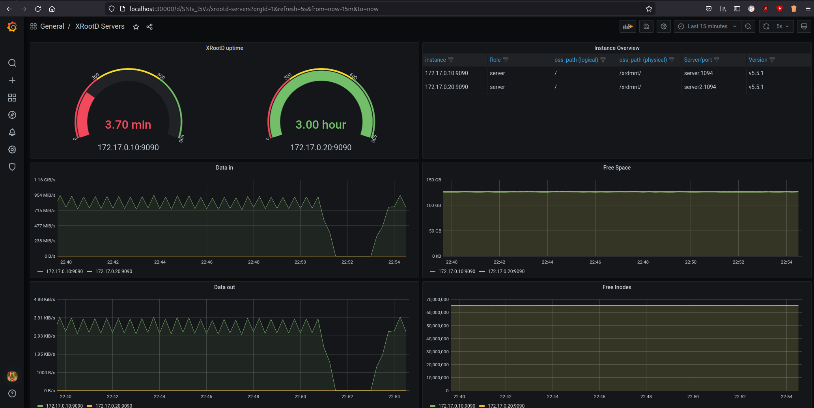

# XRootD Monitoring Setup

A Vagrant setup using multiple XRootD data servers running the [xrootd-exporter](https://git.gsi.de/dc/XRootD-Reps/xrootd-exporter) and a Prometheus/Grafana instance.

## Dependencies 

This setup is based on:

* libvirt/kvm as virtualization provider 
* Ansible as provisioner

Therefor Ansible, libvirt and the vagrant-libvirt plugin needs to be installed on your system

## Usage

First, make sure you checked out all submodules, as this repository is primarily used to demonstrate/test/debug the [xrootd-exporter](https://git.gsi.de/dc/XRootD-Reps/xrootd-exporter).

Then, `vagrant up` starts the aforementioned servers, forwarding:

* One example exporter on localhost:9099 for easy debugging in the browser
* The grafana web service on localhost:3000 connected to the prometheus service

## Example Dashboard

You can find a simple [Dashboard model](./roles/Grafana/files/models/xrootd_server.json)
running under General / XRootD Servers on the Grafana instance.

## License

LGPL3 as described in the [License File](./LICENSE)
